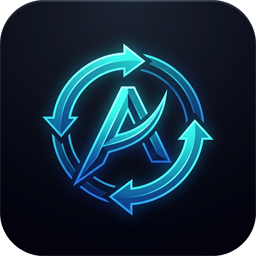

# Antigravity Account Switcher

<p align="center">
  
</p>

A Visual Studio Code extension for managing, monitoring quota, and switching Google accounts used by Google Antigravity.

---

## Overview

**Antigravity Account Switcher** extends the official Google Antigravity experience with an interactive sidebar dashboard, real-time quota tracking, background low-quota alerts, instant UI synchronization, and effortless switching between multiple Google accounts.

### Status

- **Version**: `0.8.0`
- **Supported Platforms**: Windows, macOS, Linux
- **Compatibility**: Visual Studio Code, Google Antigravity extension `1.3.0+`, AGY backend `1.2.2+`

---

## Key Features

### 1. Interactive Sidebar Dashboard (Activity Bar)
- **Runtime Status Indicator**: Live status pill showing Antigravity connection health, PID, Hub port, and Language Server port in a detailed modal.
- **Current Account Card**: Displays the active Google account, profile avatar, display name, email, and quick actions (Re-auth, Sign Out, Add Account).
- **Quota & Usage Monitor**:
  - Visual progress bars for **5-Hour Limit** and **Weekly Limit**.
  - Remaining percentage indicators and exact reset countdown times.
  - Expandable model quota breakdown.
- **Saved Accounts List**:
  - Dedicated scrollable container designed for multiple accounts without overflowing the sidebar.
  - Real-time search and filter with matched account counters.
  - Clear status badges: `Active` badge for the current account and action badges for quick switching.
  - Inline label editing and secure account removal dialogs.
  - Skeleton loading screen on initial startup.
- **Footer**: Developer attribution and links with safe external browser navigation.

### 2. Status Bar Item & 1-Click Menu
- **Real-Time Quota Glance**: Directly monitors active account quota from VS Code's status bar (e.g. `AGY: 85%`).
- **Color-Coded Status Alerts**: Dynamic warning background when quota $\le 20\%$ and critical error background when $\le 10\%$.
- **Rich Markdown Tooltip**: Hovering reveals active account details, 5-hour quota, weekly quota, exact reset countdown, and quick links.
- **Customizable Display Formats**: Choose between `compact` (`AGY: 85%`), `detailed` (`AGY: 85% (1h 45m)`), and `percentageOnly` (`85%`).
- **1-Click Quick Menu**: Click the status bar item to open a sleek QuickPick menu for instant account switching, adding accounts, opening dashboard, or refreshing.

### 3. Auto-Refresh Quota & Low Quota Reminders
- **Background Quota Monitoring**: Automatically polls and refreshes active account quota at customizable intervals (e.g. 1m, 5m, 15m, 30m, 1h).
- **Low Quota Notification Alert**: Displays warning notifications when quota drops below threshold (e.g. 20%) with quick action buttons:
  - `[Switch Account]`: Opens interactive account switcher.
  - `[View Details]`: Opens the account switcher dashboard.
- **Smart Deduplication**: Prevents alert spam by tracking notification state per reset cycle.

### 4. Antigravity UI Synchronization (No Window Reload)
- **Instant Official Panel Sync**: Automatically reconnects and refreshes the official Google Antigravity sidebar (`google.google-antigravity`) upon account switch, sign-out, or re-authentication via internal RPC hooks (`antigravity.reconnect` / `antigravity.triggerUpdate`).
- **Zero Disruptions**: Eliminates the need to reload the VS Code window or lose active editor states.
- **Safe Fallback**: Provides an optional prompt to reload window only if official auto-sync cannot be confirmed.

### 5. Settings & Personalization Modal
- Accessible via the gear icon (`⚙`) on the dashboard header:
  - **Appearance**: Theme selection (*Follow VS Code*, *Dark*, *Light*, *System*) and Bilingual Language support (*English*, *Bahasa Indonesia*, *Automatic*).
  - **Quota & Reminders**: Enable/disable background auto-refresh, polling interval, warning threshold (5% - 30%), and smart fallback.
  - **Backup & Restore**: 1-click Export and Import of saved accounts metadata with deduplication.
  - **Layout**: Show or hide individual dashboard sections (Antigravity Status, Current Account, Saved Accounts).
  - **About**: Version, developer info, and website link.

### 6. Quota Reset Alarms & Restoration Notifications
- Automatically monitors exhausted or low-quota accounts and calculates exact reset countdowns.
- Notifies immediately via desktop popup when an account's quota reset window passes and quota is restored.
- Configurable via `boygr.antigravityAccountSwitcher.notifyQuotaReset`.

### 7. Account Color Tags & Visual Badges
- Assign custom color accents (`Blue`, `Green`, `Purple`, `Amber`, `Rose`, `Teal`) to any saved account.
- Renders colored indicator dots next to account labels and colored avatar ring accents on both Current Account and Saved Accounts cards.
- Preserves color tags during JSON export and import.

### 8. Workspace / Project Folder Association
- Link specific project folders or workspaces to preferred Antigravity accounts.
- Automatic prompt upon opening workspace to switch to the linked account (`boygr.antigravityAccountSwitcher.autoPromptWorkspaceAccount`).
- Dedicated workspace link banner in the dashboard and workspace badge tags in the Saved Accounts list.

### 9. 7-Day Quota Usage History & Analytics
- Automatically records daily minimum remaining quota for each account.
- Renders an interactive 7-day mini bar chart in the accounts view with color-coded health indicators (Healthy, Warning, Critical).
- Detailed hover tooltips showing weekday, date, and minimum remaining quota percentage.

### 10. Account Grouping & Profile Filters
- Categorize accounts into groups (`Personal`, `Work`, `Client`, or custom group tags).
- Interactive filter chips above Saved Accounts allow 1-click filtering by category.
- Group badge chips visually displayed on both Current and Saved account cards.
- Search accounts dynamically by group tag name.
- Group assignments preserved across JSON backups and imports.

### 11. Rate Limit Auto-Switch Detection
- Detects complete quota exhaustion (0% remaining / rate limit) immediately upon background refresh or model check.
- Triggers an instant error modal with a 1-click switch prompt to the best available backup account.
- Configurable via `boygr.antigravityAccountSwitcher.autoSwitchOnExhaustion`.

### 12. Quota Analytics CSV & JSON Export
- Export full historical quota records across all accounts to standard `.csv` or formatted `.json`.
- Direct "Export" button in the 7-Day Quota Analytics dashboard header.
- Accessible via command `boygr.antigravityAccountSwitcher.exportQuotaAnalytics`.

---

## Security Model

- **No Credential Interception**: Does not implement independent OAuth or capture Google passwords, access tokens, refresh tokens, or session cookies.
- **Official Google Auth Reuse**: Leverages Antigravity's built-in OAuth flow (`AuthStartLogin` / `AuthStartReauth`).
- **Memory-Only CSRF**: Hub CSRF tokens are retained strictly in memory during operation and never written to disk.
- **Non-Destructive Storage**: Does not alter VS Code's internal database (`state.vscdb`) or tamper with `.gemini` configurations.
- **Metadata Only**: Local account storage preserves only non-sensitive descriptors (email, custom label, display name, timestamps).

---

## Commands

Access these commands via the VS Code Command Palette (`Ctrl+Shift+P` / `Cmd+Shift+P`):

| Command | Title | Shortcut | Description |
| :--- | :--- | :--- | :--- |
| `boygr.antigravityAccountSwitcher.statusBarMenu` | **Status Bar Menu** | `Alt+A` (`Cmd+Alt+A`) | Open QuickPick menu to switch accounts sorted by quota |
| `boygr.antigravityAccountSwitcher.refreshAccountsView` | **Refresh** | `Alt+Shift+A` (`Cmd+Alt+Shift+A`) | Refresh runtime status, active account, quota, and saved accounts |
| `boygr.antigravityAccountSwitcher.switchAccount` | **Switch Account** | | Switch to a saved account directly or via QuickPick |
| `boygr.antigravityAccountSwitcher.setWorkspaceAccount` | **Set Default Account for Workspace...** | | Link active project folder to a default Antigravity account |
| `boygr.antigravityAccountSwitcher.clearWorkspaceAccount` | **Clear Default Account for Workspace** | | Remove project folder account link |
| `boygr.antigravityAccountSwitcher.exportAccounts` | **Export Saved Accounts...** | | Export saved accounts metadata to JSON file |
| `boygr.antigravityAccountSwitcher.importAccounts` | **Import Saved Accounts...** | | Import and merge saved accounts from JSON file |
| `boygr.antigravityAccountSwitcher.exportQuotaAnalytics` | **Export Quota Analytics (CSV/JSON)...** | | Export historical quota records to CSV or JSON file |
| `boygr.antigravityAccountSwitcher.reconnectHub` | **Reconnect Antigravity Hub** | | Force re-establish connection to local hub process |
| `boygr.antigravityAccountSwitcher.restartBackend` | **Restart Backend Process** | | Terminate stuck `agy` backend process and reload |
| `boygr.antigravityAccountSwitcher.addAccount` | **Add / Switch Google Account** | | Initiate login to register a new Google account |
| `boygr.antigravityAccountSwitcher.manageAccounts` | **Manage Accounts** | | QuickPick-based account manager menu |
| `boygr.antigravityAccountSwitcher.openSettings` | **Settings** | | Open dashboard settings modal |
| `boygr.antigravityAccountSwitcher.currentAccount` | **Current Account** | | Show active account information |
| `boygr.antigravityAccountSwitcher.authStatus` | **Auth Status** | | Inspect current authentication status |
| `boygr.antigravityAccountSwitcher.reAuth` | **Re-auth** | | Re-authenticate active Antigravity session |
| `boygr.antigravityAccountSwitcher.signOut` | **Sign Out** | | Safely log out active Antigravity account |
| `boygr.antigravityAccountSwitcher.diagnose` | **Diagnose Antigravity** | | Run diagnostics on backend connectivity |
| `boygr.antigravityAccountSwitcher.inspectBridge` | **Inspect Bridge** | | Inspect Language Server / Hub bridge |

---

## Configuration Settings

Customize behavior via VS Code Settings (`settings.json`):

```json
{
  // Show Antigravity active account quota indicator in the status bar (default: true)
  "boygr.antigravityAccountSwitcher.showStatusBarItem": true,

  // Display format for status bar indicator: "compact", "detailed", "percentageOnly" (default: "compact")
  "boygr.antigravityAccountSwitcher.statusBarFormat": "compact",

  // Auto-refresh quota interval in minutes (0 = manual only, default: 5)
  "boygr.antigravityAccountSwitcher.autoRefreshIntervalMinutes": 5,

  // Show notification alert when remaining quota is low (default: true)
  "boygr.antigravityAccountSwitcher.enableLowQuotaReminder": true,

  // Remaining quota threshold percentage for low quota warnings (default: 20)
  "boygr.antigravityAccountSwitcher.lowQuotaThresholdPercent": 20,

  // Suggest 1-click switch to backup account with highest quota when low (default: true)
  "boygr.antigravityAccountSwitcher.smartQuotaFallback": true,

  // Suggest immediate 1-click switch to best backup account when quota is 0% exhausted (default: true)
  "boygr.antigravityAccountSwitcher.autoSwitchOnExhaustion": true,

  // Notify when a low or exhausted account's quota reset window has finished (default: true)
  "boygr.antigravityAccountSwitcher.notifyQuotaReset": true,

  // Automatically prompt to switch to the linked account when opening a project workspace (default: true)
  "boygr.antigravityAccountSwitcher.autoPromptWorkspaceAccount": true,

  // Automatically sync official Antigravity UI on account changes (default: true)
  "boygr.antigravityAccountSwitcher.autoSyncOfficialUi": true
}
```

---

## Installation

### From VSIX Package

1. Download or locate `release/antigravity-account-switcher-0.8.0.vsix`.
2. In VS Code:
   - Go to **Extensions** (`Ctrl+Shift+X` / `Cmd+Shift+X`).
   - Click the `...` menu (top right of Extensions view).
   - Select **Install from VSIX...**.
   - Choose the file.
3. Or install via terminal:
   ```powershell
   code --install-extension release/antigravity-account-switcher-0.8.0.vsix
   ```

---

## Development & Building

```powershell
# Install dependencies
npm install

# Compile TypeScript
npm run compile

# Run in development mode (Press F5 in VS Code)
# Launches Extension Development Host with synchronous compilation preLaunchTask

# Build production VSIX package
npm run package:vsix
```

---

## Author & License

- **Author & Developer**: [Boy Gilang Ramadhan](https://boygr.com)
- **License**: [MIT License](LICENSE)
- **Disclaimer**: Not affiliated with or endorsed by Google. Google Antigravity is a trademark of Google LLC.
